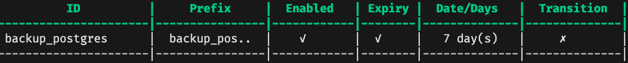

# docker-backup-database

[](https://godoc.org/github.com/appleboy/docker-backup-database)
[](https://cloud.drone.io/appleboy/docker-backup-database)
[](https://codecov.io/gh/appleboy/docker-backup-database)
[](https://goreportcard.com/report/github.com/appleboy/docker-backup-database)
[](https://hub.docker.com/r/appleboy/docker-backup-database/)

Docker image to periodically backup a your database (MySQL or Postgres) to Local Disk or S3 ([AWS S3](https://aws.amazon.com/free/storage/s3) or [Minio](https://min.io/)).

## Support Database

* Postgres (9, 10, 11, 12, 13)
* MySQL (5.6, 5.7, 8)

## Usage

First steps: Setup the Minio and Postgres 12 Server using docker-compose command.

```yaml
services:
  minio:
    image: minio/minio:edge
    volumes:
      - data1-1:/data1
    ports:
      - 9000:9000
    environment:
      MINIO_ACCESS_KEY: 1234567890
      MINIO_SECRET_KEY: 1234567890
    command: server /data
    healthcheck:
      test: ["CMD", "curl", "-f", "http://localhost:9000/minio/health/live"]
      interval: 30s
      timeout: 20s
      retries: 3

  postgres:
    image: postgres:12
    restart: always
    volumes:
      - pg-data:/var/lib/postgresql/data
    logging:
      options:
        max-size: "100k"
        max-file: "3"
    environment:
      POSTGRES_USER: db
      POSTGRES_DB: db
      POSTGRES_PASSWORD: db
```

Second Steps: Backup your database and upload the dump file to S3 storage.

```yaml
  backup_postgres:
    image: appleboy/docker-backup-database:postgres-12
    logging:
      options:
        max-size: "100k"
        max-file: "3"
    environment:
      STORAGE_DRIVER: s3
      STORAGE_ENDPOINT: minio:9000
      STORAGE_BUCKET: test
      STORAGE_REGION: ap-northeast-1
      STORAGE_PATH: backup_postgres
      STORAGE_SSL: "false"
      STORAGE_INSECURE_SKIP_VERIFY: "false"
      ACCESS_KEY_ID: 1234567890
      SECRET_ACCESS_KEY: 1234567890

      DATABASE_DRIVER: postgres
      DATABASE_HOST: postgres:5432
      DATABASE_USERNAME: db
      DATABASE_PASSWORD: db
      DATABASE_NAME: db
      DATABASE_OPTS:
```

Final Step: [manage bucket lifecycle](https://docs.min.io/docs/minio-bucket-lifecycle-guide.html) using [MinIO Client (mc)](https://docs.min.io/docs/minio-client-quickstart-guide.html).

```yaml
$ mc ilm import minio/test <<EOF
{
    "Rules": [
        {
            "Expiration": {
                "Days": 7
            },
            "ID": "backup_postgres",
            "Filter": {
                "Prefix": "backup_postgres/"
            },
            "Status": "Enabled"
        }
    ]
}
EOF
```

Lifecycle configuration imported successfully to `minio/test` and list the current settings

```sh
mc ilm ls minio/test
```



Cron schedule to run periodic backups.

```yaml
  backup_mysql:
    image: appleboy/docker-backup-database:mysql-8
    logging:
      options:
        max-size: "100k"
        max-file: "3"
    environment:
      STORAGE_DRIVER: s3
      STORAGE_ENDPOINT: minio:9000
      STORAGE_BUCKET: test
      STORAGE_REGION: ap-northeast-1
      STORAGE_PATH: backup_mysql
      STORAGE_SSL: "false"
      STORAGE_INSECURE_SKIP_VERIFY: "false"
      ACCESS_KEY_ID: 1234567890
      SECRET_ACCESS_KEY: 1234567890

      DATABASE_DRIVER: mysql
      DATABASE_HOST: mysql:3306
      DATABASE_USERNAME: root
      DATABASE_PASSWORD: db
      DATABASE_NAME: db
      DATABASE_OPTS:

      SCHEDULE: @daily
```

Each line of a crontab file represents a job, and looks like this:

```sh
# ┌───────────── minute (0 - 59)
# │ ┌───────────── hour (0 - 23)
# │ │ ┌───────────── day of the month (1 - 31)
# │ │ │ ┌───────────── month (1 - 12)
# │ │ │ │ ┌───────────── day of the week (0 - 6) (Sunday to Saturday;
# │ │ │ │ │                                   7 is also Sunday on some systems)
# │ │ │ │ │
# │ │ │ │ │
# * * * * * <command to execute>
```

A cron expression represents a set of times, using 5 space-separated fields.

Field name   | Mandatory? | Allowed values  | Allowed special characters
----------   | ---------- | --------------  | --------------------------
Minutes      | Yes        | 0-59            | * / , -
Hours        | Yes        | 0-23            | * / , -
Day of month | Yes        | 1-31            | * / , - ?
Month        | Yes        | 1-12 or JAN-DEC | * / , -
Day of week  | Yes        | 0-6 or SUN-SAT  | * / , - ?

You may use one of several pre-defined schedules in place of a cron expression.

```sh
Entry                  | Description                                | Equivalent To
-----                  | -----------                                | -------------
@yearly (or @annually) | Run once a year, midnight, Jan. 1st        | 0 0 1 1 *
@monthly               | Run once a month, midnight, first of month | 0 0 1 * *
@weekly                | Run once a week, midnight between Sat/Sun  | 0 0 * * 0
@daily (or @midnight)  | Run once a day, midnight                   | 0 0 * * *
@hourly                | Run once an hour, beginning of hour        | 0 * * * *
```
